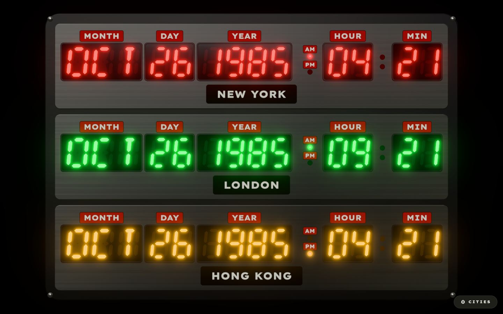
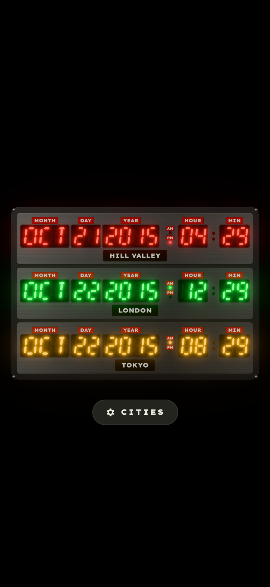

# Time Circuits (web)

  

A Back to the Future **Time Circuits** world clock for the browser. It shows
three cities on red, green and amber LED rows, rendered in 3D with three.js.

This is the web version of the iOS/macOS app
[bttfclock](https://github.com/pcwilliams/bttfclock). It uses the same
segment shapes, colours, city catalog and behaviour.

**Live:** https://pcwilliams.github.io/bttfclock-web/



## Features

- **Three time zones at a glance:** month, day, year, hour and minute,
  with AM/PM lamps, for up to three cities. The defaults are New York,
  London and Hong Kong.
- **Faithful LEDs:** hand-built 7- and 14-segment glyphs with italic
  lean, dim "ghost" segments behind the gel, and a soft coloured glow
  that keeps the digits crisp.
- **A ticking colon** that steps on the wall-clock second: on for the
  first half, off for the second.
- **Subtle 3D, straight-on:** raised brushed-metal panels, recessed
  windows behind glass, and domed lamps and rivets, all lit like a
  photo of the prop.
- **CITIES panel:** pick from 40 cities, search, reorder and remove.
  The row colour follows position: red for destination, green for
  present, amber for last departed. Your choice is saved in the browser.
- **Install as an app:** put it on your home screen, dock or app list.
  It opens full-screen with no browser bars and keeps working offline.
- Includes a **Hill Valley** easter egg.



## Using it

- Click **CITIES**, or press `,`, to manage cities. Press `Esc` to close.
- To **install it as an app**:
  - **Chrome / Edge (desktop and Android):** click **INSTALL** next to
    CITIES, or use **Install app** in the browser menu.
  - **iPhone / iPad:** tap **Share**, then **Add to Home Screen**.
  - **Safari on a Mac:** choose **File → Add to Dock**.

  The CITIES panel shows the right instructions for your browser.
- Add parameters to the URL to set it up:

| Parameter | Example | What it does |
|---|---|---|
| `frozendate` | `?frozendate=1985-10-26T01:21:00-07:00` | Freezes the display at a moment in time (include the UTC offset) |
| `cities` | `?cities=hill_valley,london,tokyo` | Chooses the cities |
| `settings` | `?settings` | Opens the CITIES panel straight away |

For example:
[`?frozendate=2015-10-21T16:29:00-07:00&cities=hill_valley,london,tokyo`](https://pcwilliams.github.io/bttfclock-web/?frozendate=2015-10-21T16:29:00-07:00&cities=hill_valley,london,tokyo)

City ids are the lower-case names with underscores, for example
`new_york`, `sao_paulo` and `hill_valley`. They're listed in
`js/models/cityCatalog.js`.

## Running locally

There's no build step and there are no dependencies. Any static file
server works:

```bash
git clone https://github.com/pcwilliams/bttfclock-web
cd bttfclock-web
python3 -m http.server 8000
# open http://localhost:8000/
```

Opening `index.html` directly from disk won't work, because browsers
block ES modules on `file://`.

Run the tests with Node 20 or later:

```bash
node --test
```

## Requirements

You need a browser with WebGL 2: any current Chrome, Edge, Firefox or
Safari (desktop or iOS).

## How it's built

- three.js is loaded from a CDN through an import map, so there's
  nothing to compile.
- The digits are drawn at their true colour. Their glow is drawn
  separately, blurred, and laid on top, so the numbers stay sharp.
- The page only redraws when something changes, so a running clock draws
  two frames a second instead of sixty.
- A small service worker keeps a copy of the app, three.js and the font,
  so the installed clock starts without a connection. While you're
  online, it always fetches the latest version first.

See [`architecture.html`](architecture.html) for diagrams and
[`tutorial.html`](tutorial.html) for how it was built.

## Deploying

Every push to `main` runs the tests and publishes to GitHub Pages using
`.github/workflows/pages.yml`. In a fork, first set **Settings → Pages →
Source** to **GitHub Actions**.

## Credits

Back to the Future and the Time Circuits are trademarks of their
respective owners. This is a fan-made clock.
